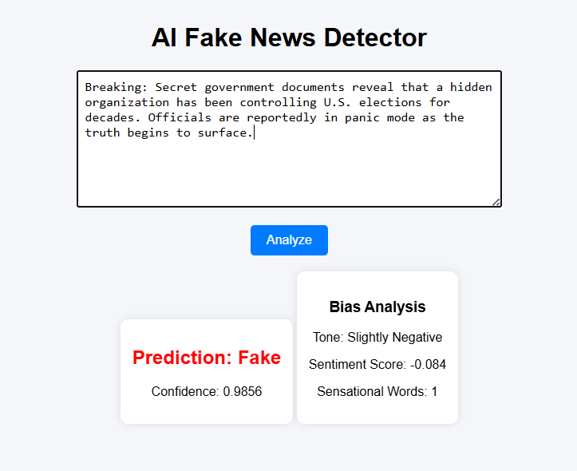

# 📰 AI Fake News Detector (BERT + Bias Analysis)

## 🚀 Overview
An AI-powered fake news detection system built using classical Machine Learning and state-of-the-art Transformer models (BERT).  
The system classifies news articles as Fake or Real and provides confidence scoring and bias analysis.

---

## Demo Screenshot



---

## 🧠 Models Used

### 🔹 Logistic Regression (Baseline)
- TF-IDF Vectorization
- Accuracy: ~98.4%

### 🔹 Fine-Tuned BERT (Transformer)
- Pretrained: bert-base-uncased
- Fine-tuned on ISOT Fake News Dataset
- Accuracy: ~99.8%

---

## 📊 Features

- ✅ Real-time prediction
- ✅ Confidence score
- ✅ Sentiment-based bias detection
- ✅ Sensational keyword detection
- ✅ Flask web interface

---

## 🛠 Tech Stack

- Python
- PyTorch
- HuggingFace Transformers
- Scikit-learn
- Flask
- TextBlob

---

## 📂 Dataset

- ISOT Fake News Dataset (~45,000 articles)
- Source: Kaggle

---

## ⚙️ How to Run Locally

```bash
git clone https://https://github.com/Mr-Karthik-1505/AI-Fake-News-Detector.git
cd AI-Fake-News-Detector
pip install -r requirements.txt
python app.py